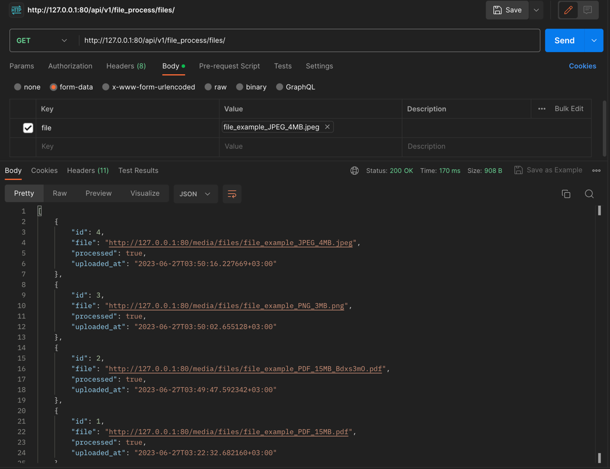
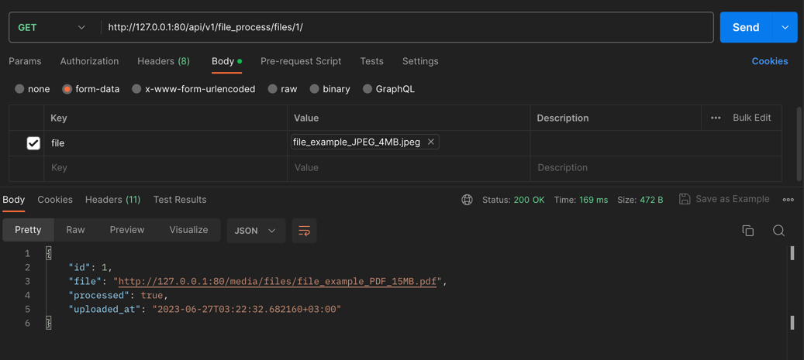
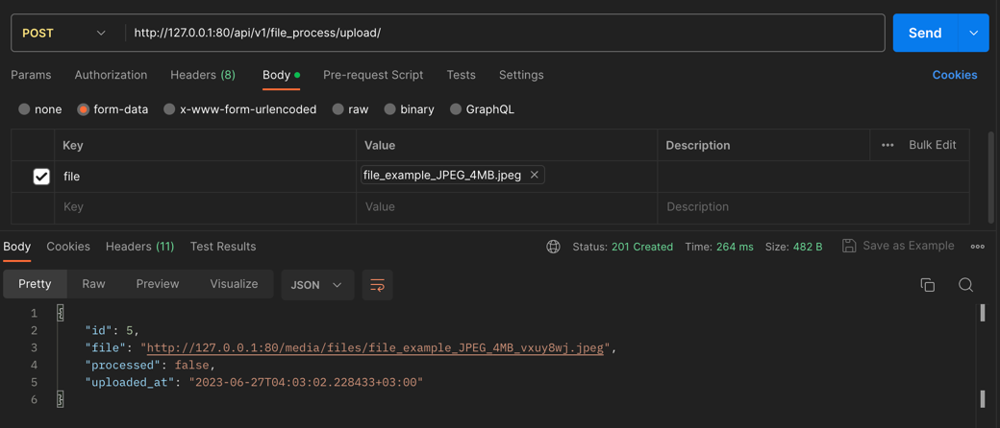

# File Compresser API

This project is an implementation of a small Django REST API 
that compresses files.

The API handles type files:
* `.pdf`
* `.wav` and `.mp3`
* `.jpeg` and `.png`

You can find samples of each file type in the `samples` folder.

## Setup

### Locally

You can deploy the API locally on your computer:

#### 1. Clone repository
```commandline
git clone https://github.com/RolfAdolf/file-process.git

cd file-process
```

#### 2. Create Virtual Environment

Create virtual environment with `pyenv` or `poetry`.

```commandline
python3 -m venv venv
source venv/bin/activate

pip install -r requirements.txt
```

#### 3. Set the `.env`-file

Before the API deployment, you need to create an environment file `.env` with the following fields, 
as shown below. Place this file in the root directory of the repository.

```commandline
POSTGRES_HOST=db
POSTGRES_PORT=5432
POSTGRES_DB=*****
POSTGRES_USER=*****
POSTGRES_PASSWORD=*****

DJANGO_SUPERUSER_USERNAME=*****
DJANGO_SUPERUSER_PASSWORD=*****
DJANGO_SUPERUSER_EMAIL=*****

DJANGO_SETTINGS_MODULE=file_process.settings.prod
```


#### 4. Apply migrations

```commandline
cd file_process

python3 manage.py migrate
```

#### 5. Create RabbitMQ broker with Docker

```commandline
docker run -it --rm --name rabbitmq -p 5672:5672 -p 15672:15672 rabbitmq:management
```

#### 6. Start the Celery worker

```commandline
celery -A file_process worker -l info
```

#### 7. Run the server

Run the server in the new terminal.

```commandline
python3 manage.py runserver
```


#### Remark

This implementation uses PostgreSQL, but you can use any other 
compatible database, including SQLite.


### Docker

The Docker is the easiest way to deploy the API. It will only take one command:

```commandline
docker compose up
```


### Tests

You can test the code with the following command:

```commandline
python3 manage.py test files.tests

# or

python3 manage.py test files.tests.integration

# or

python3 manage.py test files.tests.unit
```


### API instruction


You can try out the API in different ways:


#### `requests` library

```commandline
>>> import requests
>>> url = "http://127.0.0.1:80/api/v1/file_process/upload/"
>>> response = requests.post(url, files={"file": ('test_file.jpeg', open('file_process/media/samples/file_example_JPEG_4MB.jpeg', 'rb').read(), 'image/jpeg')})
>>> response.json()
{'id': 6, 'file': 'http://127.0.0.1/media/files/test_file.jpeg', 'processed': False, 'uploaded_at': '2023-06-27T04:10:52.261877+03:00'}
```


#### Postman App









***
### Contacts
For all questions, please contact:

`Telegram`: @Nadir_Devrishev

`Mail`: nadir.dewrishew@gmail.com